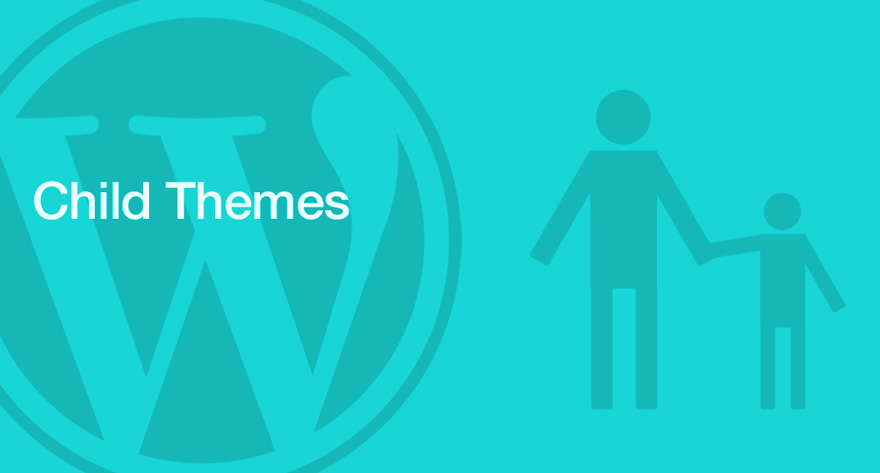
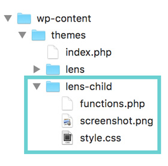

###### Front-End Part.

## HTML/CSS 기초

1. CSS 박스 모델
1. CSS 선택자와 적용 우선순위 규칙
1. Wordpress 자식 테마

## Wordpress Child Theme

제작(구입)한 워드프레스 테마를 사용자 입맛에 수정하고자 할 경우, 원본 테마를 수정하기 보다는 자식 테마를 만들어 수정해야 합니다.
원본 테마를 수정하더라도 사용자가 원하는 설정으로 변경 가능하지만 수정한 내용은 추후 테마 업그레이드 시에 모두 사라져버리게 되기 때문이죠.
하지만 자식 테마는 원본 테마의 업그레이드와는 무관하게 사용자가 설정한 내용으 모두 보존됩니다. 자식 테마를 사용해야 하는 이유입니다.

자식 테마 동작의 기본 원리는 원본 테마를 부모로 설정하여 모든 기능을 상속받는 것입니다. 스타일 또한 기능에 속하기에 원본 테마의
스타일을 수정하지 않고도 자식 테마에서 스타일 수정을 하면 원본 테마의 스타일을 덮어쓰게 됩니다. 정리하면 원본 테마의 스타일이 아닌
자식 테마의 스타일이 적용되게 되는 것입니다.



---

#### 1. 자식 테마 폴더는 설치된 워드프레스의 아래 경로에 생성합니다.

`/Wordpress-설치-경로/wp-content/themes`



자식 테마 폴더에는 일반적으로 아래 3개 파일을 생성합니다.

- **`screenshot.png`**<br>자식 테마 스크린샷
- **`style.css`**<br>원본 테마 스타일을 덮어 쓸 자식 테마 스타일(CSS) 파일
- **`functions.php`**<br>원본 테마 기능을 덮어 쓸 자식 테마 기능(PHP) 파일

-

#### 2. 자식 테마 폴더에 `style.css` 파일을 생성한 후, 원본 테마 스타일을 상속받는 코드를 작성합니다.

```css
/*
Theme Name:  테마 이름
Theme URl:   테마 제공 웹 주소
Author:      테마 제작자 이름
Author URl:  테마 제작자 웹 주소
Description: 테마 설명
Template:    상속받을 원본 테마 이름
Version:     버전
*/

/* 원본(부모) 테마 style.css 파일 호출 */
@import url(../원본-테마-이름/style.css);
```

-

#### 3. 자식 테마 활성화

워드프레스 대쉬보드에서 `Appearance(외모) > Theme` 메뉴에서 추가한 자식 테마를 활성화하면 사이트에 적용됩니다.