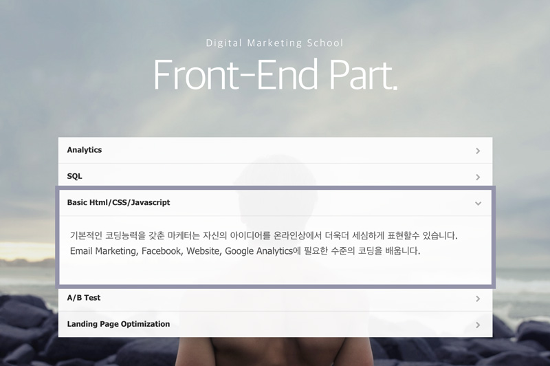

<!-- https://github.com/yamoo9/DMS-front-end -->
###### Digital Marketing School ─ FastCampus
## Front-End Part.

기본적인 코딩능력을 갖춘 마케터는 자신의 아이디어를 온라인 상에서 더욱 더 세심하게 표현할 수 있습니다. 

**Email Marketing**, **Facebook**, **Website**, **Google Analytics**에 필요한 수준의 코딩을 배웁니다.

-

### Agenda (30H)

1. HTML 의미 구조화 (Semantic Markup)
1. CSS 스타일링/레이아웃 (Styling & Layout)
1. Wordpress Pages/Posts 구조 스타일링

-

### Reference

- 영문
    - [w3schools.com](http://www.w3schools.com/)
    - [JavaScript Tutorial for Absolute Beginners](https://www.youtube.com/watch?v=XL9Ri8pO68w)
    - [30Days to Learn HTML&CSS](https://www.youtube.com/watch?v=yTHTo28hwTQ&list=PLgGbWId6zgaWZkPFI4Sc9QXDmmOWa1v5F)
    - [30Days to Learn jQuery](https://www.youtube.com/watch?v=_ZYy4kof5Oo&list=PLuwqxbvf3olp-FNFjkdWyNvrh_DCkH_TA)

- 번역
    - [MDN: Mozilla developer Network](https://developer.mozilla.org/ko/)
    - [CSS 레이아웃을 배웁시다](http://ko.learnlayout.com/)
    - [한국어 번역글 위키](https://github.com/nolboo/nolboo.github.io/wiki)

- 한글
    - [생활코딩 HTML](https://opentutorials.org/course/2039)
    - [생활코딩 CSS](https://opentutorials.org/course/45/2)
    - [생활코딩 Javascript](https://opentutorials.org/course/1375)